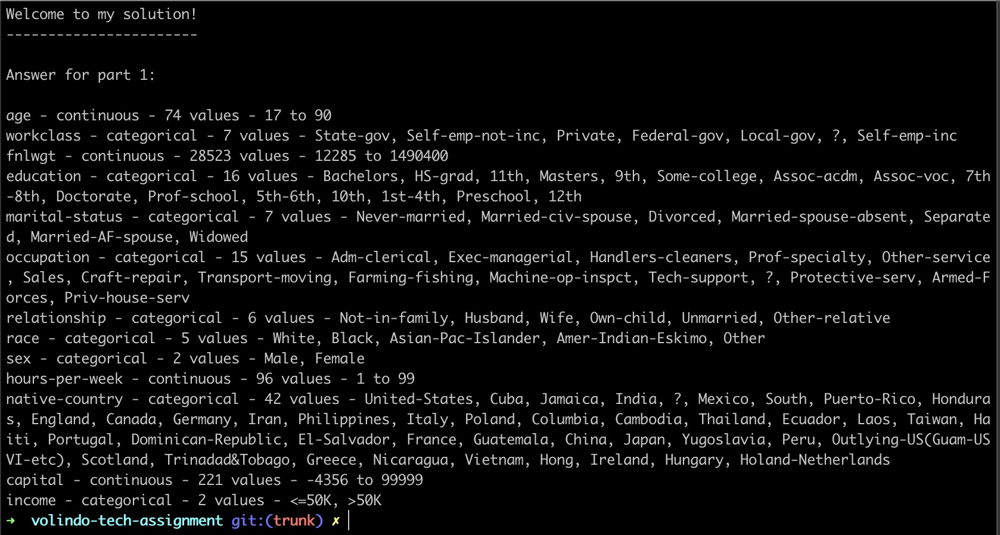
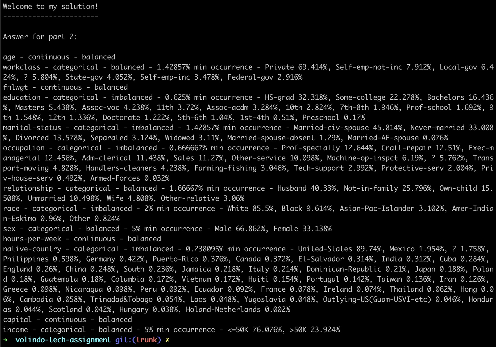

# Volindo's Technical Assignment

Instructions are to be found at [docs/assignment.md](docs/assignment.md).

## Key Features

- OOP, clean code and clean architecture principles are used throughout the code.
- Usage of Docker Compose to simplify usage of this project.
- Usage of Makefile to simplify commands to use project into a single and simple command.

## How To Run

> :warning: Make sure to have Docker installed.

### Answer For Part 1

On a terminal run:

``` sh
make part-1
```



### Answer For Part 2

On a terminal run:

``` sh
make part-2
```


